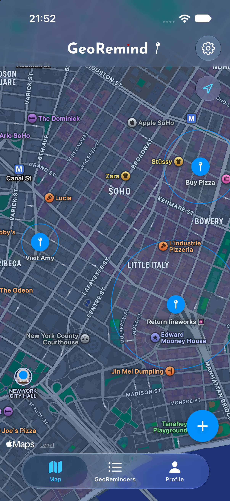
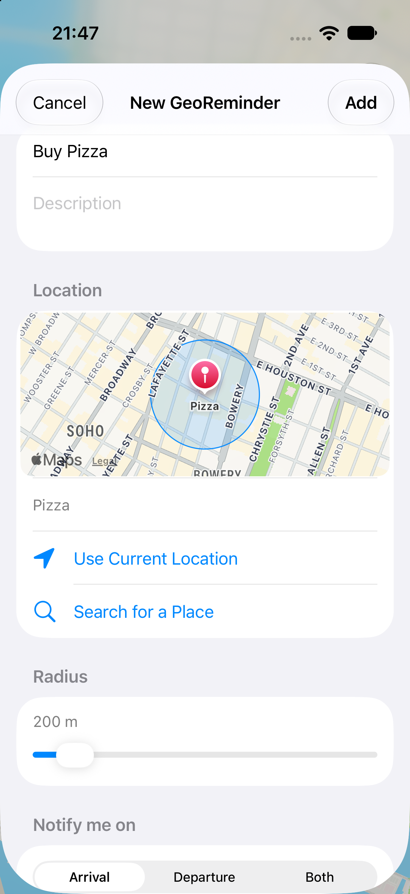
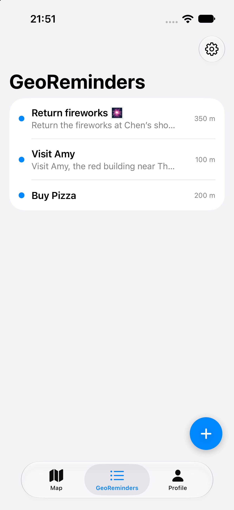
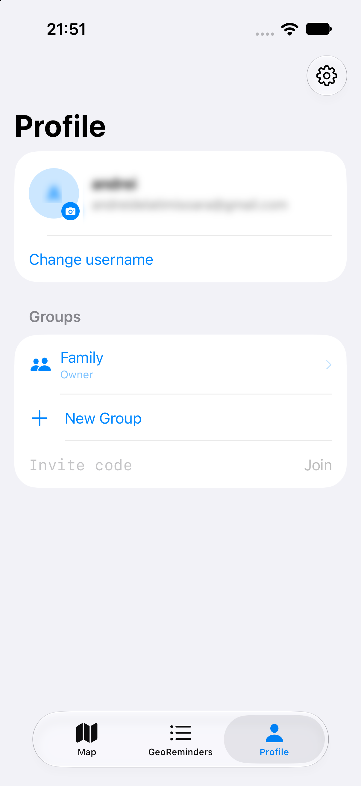
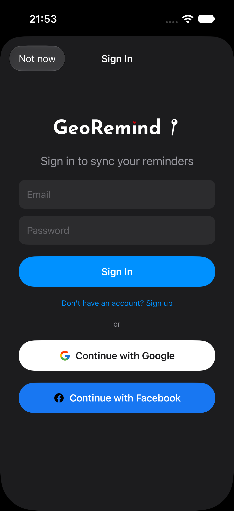
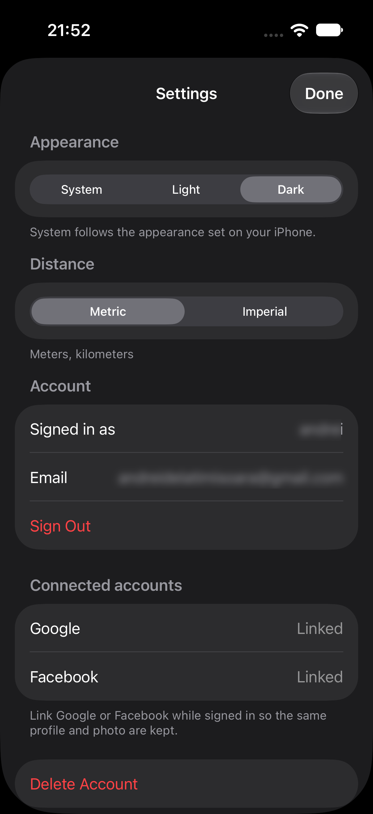

# GeoRemind

Location reminders on a map. You drop a pin, set a radius, and the phone pings you when you get there (or when you leave). No time, no calendar — just place.

<p align="center">
  
  
  
</p>
<p align="center">
  <sub>1. Map with pins and geofence circles &nbsp;·&nbsp; 2. New reminder (radius + group) &nbsp;·&nbsp; 3. Reminders list</sub>
</p>

You can use it without an account — everything stays on that iPhone. Sign in (email, Google, or Facebook) if you want sync and groups.

## What it does

- Pins on the map, each with a visible radius. Grey = off, accent = watching.
- Search a place or use your current location. Radius is a slider, 50 m to 2 km.
- Arrival, departure, or both.
- List tab: swipe to delete / toggle. Pull to refresh. Shared pins show a little group icon.
- Groups: invite people with a 6-character code, not by adding their username. Shared reminders show up on everyone's map. Kick someone and their group pins become personal again — they keep them, the group doesn't.
- Profile: username, photo, groups, join-by-code.
- Settings: light / dark / system, metric or imperial, sign out, delete account.

iOS only lets an app monitor **20** regions in the background. GeoRemind keeps the closest active ones (roughly within 2.4 km) and reshuffles when you move.

<p align="center">
  
  
  
</p>
<p align="center">
  <sub>4. Profile / groups &nbsp;·&nbsp; 5. Sign in (optional) &nbsp;·&nbsp; 6. Settings</sub>
</p>

## Stack

SwiftUI. MapKit and CoreLocation for the map and geofences. UserNotifications for the ping. Supabase for auth, Postgres, storage (avatars), optional realtime.

Local cache on disk so geofences still work if the network is gone. Row-level security on the server: you write your own reminders; group members can read shared ones.

## Layout

```
GeoRemind/
  Views/        map, list, add, profile, auth, settings, group sheet
  Services/     geofence, auth, reminders, groups, search, notifications
  Models/       ReminderPin, profiles / groups / invites
```

`GeofenceManager` owns `CLCircularRegion`s. `ReminderStore` / `GroupStore` talk to Supabase (or the local cache if you're a guest). `AuthService` is email + OAuth.

## Run it

1. Clone, open `GeoRemind.xcodeproj`.
2. Add the [Supabase Swift](https://github.com/supabase/supabase-swift) package if Xcode hasn't resolved it.
3. URL scheme `georemind` is already in the project (OAuth callback).
4. Real device if you actually want geofences. Simulator is fine for UI.

You need your own Supabase project (auth providers, `profiles` / `groups` / `group_members` / `reminders` / `group_invites`, avatars bucket, RLS). The anon key in the client is the publishable one — RLS is what keeps other people out of your rows.

## Permissions

- **Location:** When In Use at first. **Always** if you want pings while the app is closed.
- **Notifications:** otherwise the geofence fires and nobody hears it.
- **Photos:** only if you change the profile picture.
